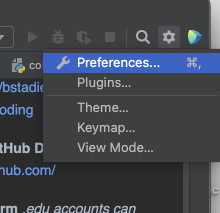
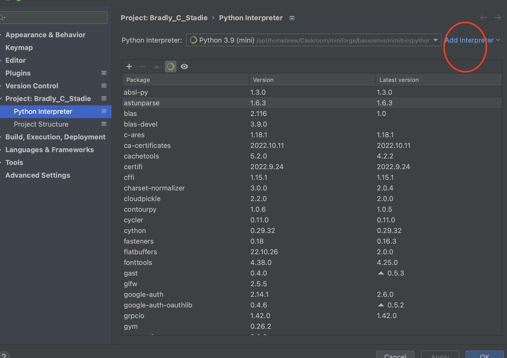
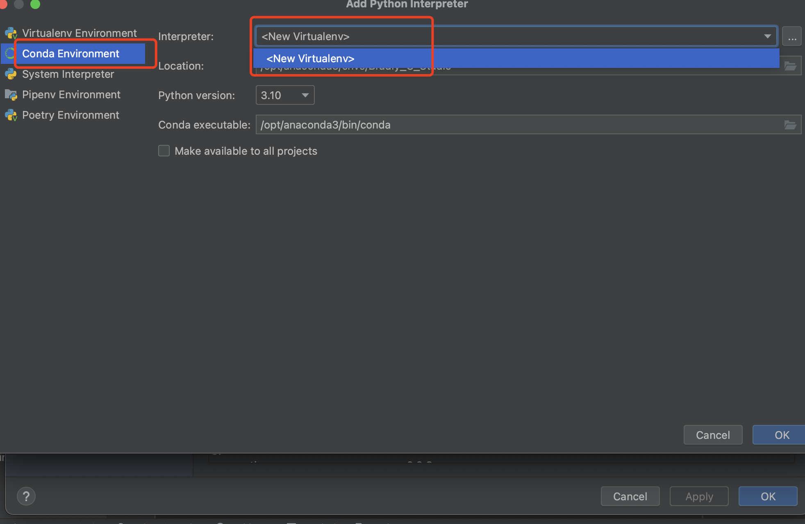
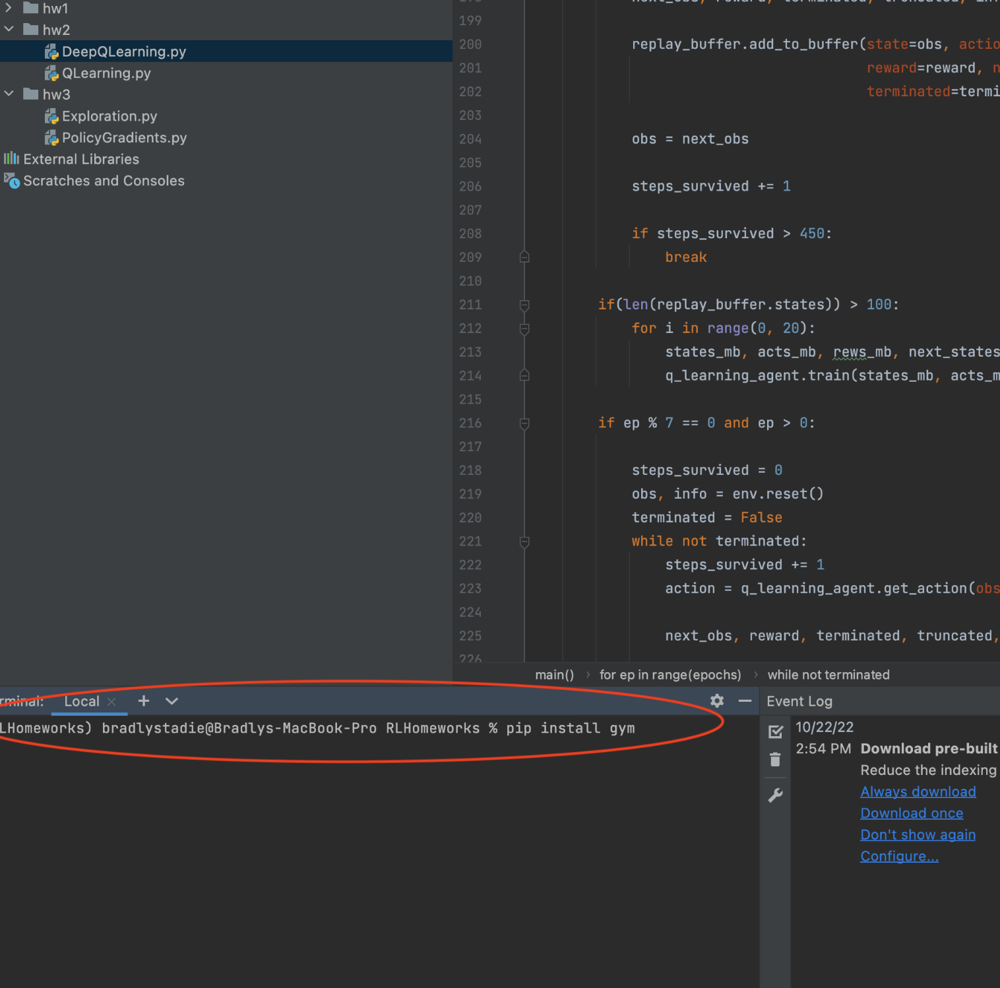
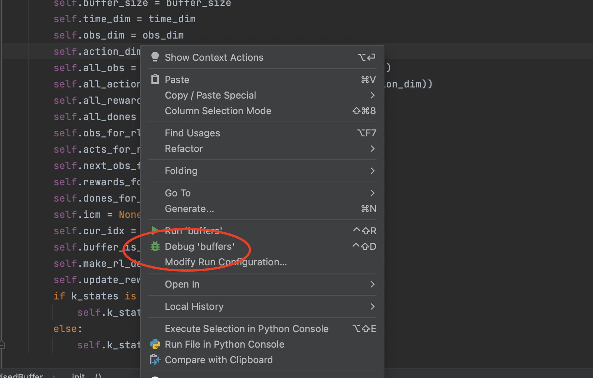
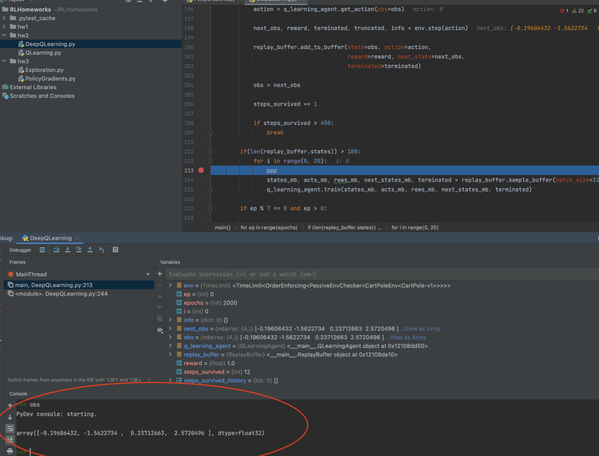
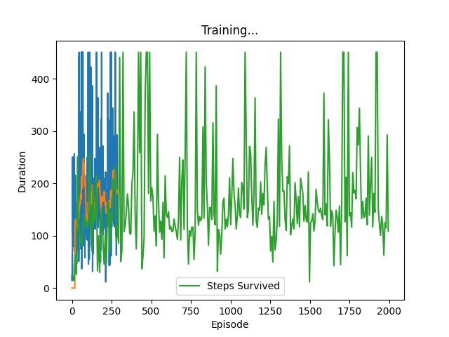

# Phase 1 - Running RL code locally

**Download the code**
https://github.com/bstadie/rl_starter_kit/tree/main/1-local-rl-coding

**Download the GitHub Desktop**
https://desktop.github.com/

**Download Pycharm** *.edu accounts can get free access to the educational version of pycharm.*
https://www.jetbrains.com/pycharm/

*.edu accounts can get free access to the educational version of pycharm.*

On the user’s local machine, they should confirm that they can get basic RL code to work.
There is a starter script in this repo called `DeepQLearning.py`, which implements DeepQLearning on a simple environment.

---

## For windows
Installing Anaconda and  PyCharm: https://marcosammon.com/images/installing_python.pdf

---

## For M1 user
If you are using mac M1, some envs can't support modules we are going to use. So we need to install miniforge and 
get environment ste up: https://kazmer-nagy-betegh.com/post/m1-machine-learning-setup/
- Be Up to Date: Update your computer if you are below macos 12.3. You can check this by clicking on the apple logo on your screens upper left corner.
- Download HomeBrew, Open terminal and use the following command:`/bin/bash -c "$(curl -fsSL https://raw.githubusercontent.com/Homebrew/install/HEAD/install.sh)"` This shall download homebre on your machine. Do not forget to follow the last steps after your installation that homebrew prompts. Which will look something like this:`- Add Homebrew to your PATH in ~/.zprofile: echo 'eval "$(/opt/homebrew/bin/brew shellenv)"' >> ~/.zprofile eval "$(/opt/homebrew/bin/brew shellenv)"`
- Install Miniforge from Homebrew: `brew install --cask miniforge`, Once the installation is complete you will need to close the terminal and reopen. 
- `If you have Anaconda installed` You need an extra step to use miniforge. This is really important.Go into the following folder:`/Users/<your-username>` Use the following key combination to reveal your hidden files: `command+shift+.`
The file name you are looking for is either .zshrc or .bahs-profile based on what you determined in the previous step.Make sure to change all instances of Anaconda3 within this file to miniforge.
- `conda init zsh` or `conda init bash` This depends on which kind of terminal profile your machine uses you can check by looking at top of your terminal window.
- Create a conda environment and don’t forget to specify the python version as it is crucial.`conda create --name <name-you-like> python==3.9.7` Activate the enviroment:`conda activate <name-you-like>`
- You can go to pycharm to use this new envs as your interpreter.

- Then add interpreter from here

- you should find your miniconda env here and apply it.

---

**terminal in pycharm**

Pycharm has a built in terminal. You can use this to install packages without switching back and forth to the terminal app. This should be mentioned and demonstrated. You can use it to install gym. Or to install the package requirements. Or even to run a bash script.

Use this terminal to `pip install gym`, go to https://pytorch.org/ to copy the 
command line to download pytorch.

---

**de-bugging in pycharm**

The debugger is quite powerful. You can add breakpoints to the code.

The debugger also opens an interactive terminal session at the bottom of the screen.

---

- Pycharm also has methods for adding path variables:https://www.jetbrains.com/help/pycharm/settings-path-variables.html
- Using pycharm, you should be able to run cartpole locally, plot the results, and view the saved plot file.

