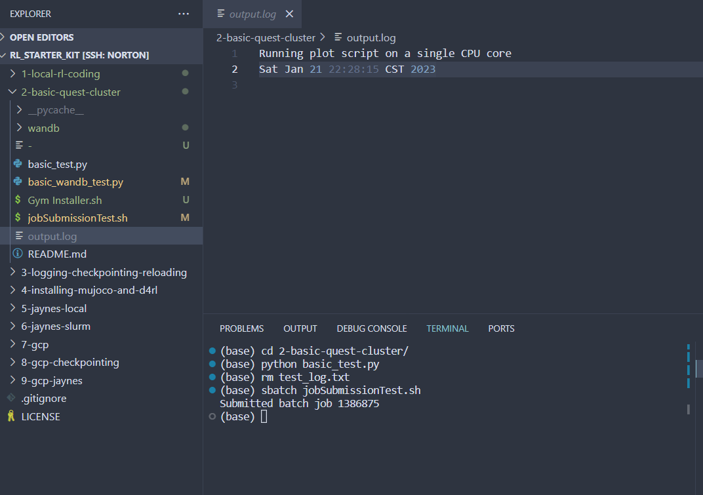
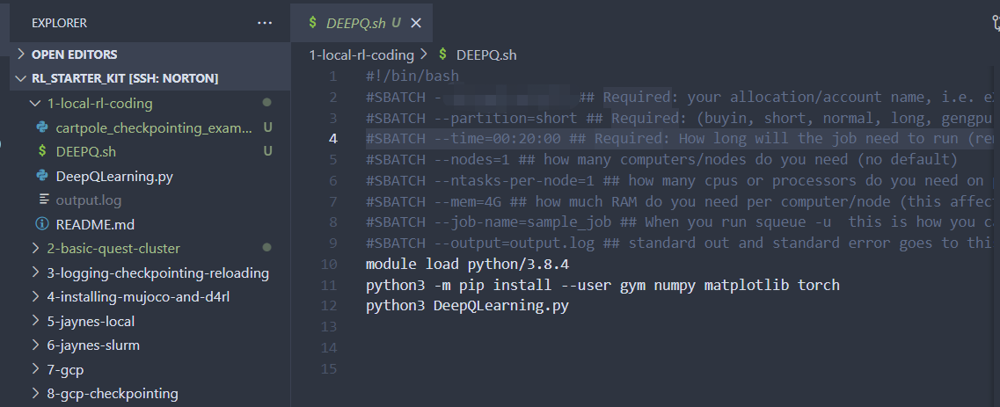
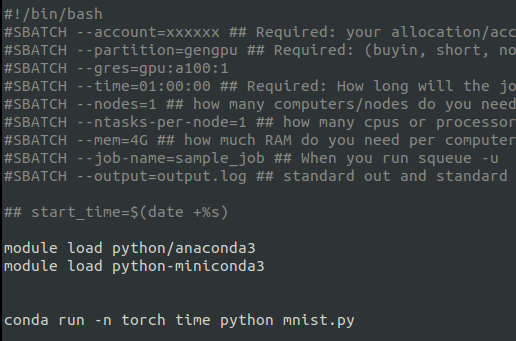

# **Get Access to Quest**
https://app.smartsheet.com/b/form/797775d810274db5889b5199c4260328

Fill out the form to get the access to Bradly's Quest allocation. 

**Note: Before requesting, make sure to ask Bradly for the proper allocation number!**

After several days you will receive your Quest account activation. The username and password are the same with your NetID and password. 

# Check Your Connection to the Cluster

Take following steps in your terminal:

ssh bcs516@quest.northwestern.edu    # This should be replaced with your netid 

git clone https://github.com/bstadie/rl_starter_kit.git

cd 2-basic-quest-cluster

python basic_test.py


Confirm the test log is there.


vim test_log.txt    #You can use either text editor like VIM, or directly open it in Pycharm.

read the contents 

exit (escape, q!, enter)


rm test_log.txt

vim jobSubmissionTest.sh


The account is currently = XXXX

Replace it with: <project name>

exit (escape, wq)

sbatch jobSubmissionTest.sh

Confirm the job submits and outputs test_log.txt





After confirming, we are able to run the RL code from 1-local-rl-coding.



# Debugging Quest Cluster
Type the following command into terminal to create an interactive session. You can test eveything to your environment in this session.

```
srun -N 1 -n 1 --account=<account> --mem=<memory>G --partition=<partition> --time=<hh:mm:ss> --pty bash -l
```

#Remember to change <> subjects with everything you want.

For example, 
```
srun -N 1 -n 1 --account=p31777 --mem=12G --partition=short --time=00:40:00 --pty bash -l
```

# Package management and Custom Packages

The clusters provided by Quest do not contain all packages needed. While it is possible to run a job and install required packages every time, the installations will not be saved and will need to be reinstalled every time. One way to make sure jobs sent to SLURM will run more efficiently is by using development environments. These serve as a package manager that can be invoked in SLURM, which will not require reinstalling packages every run.

NUQuest recommends using the `conda` environment using 

```
module load python-miniconda3/4.12.0
```

Once this module is loaded, a custom environment can be created with the following:

```
conda create --name torchenv -c conda-forge pytorch=1.11[build=cuda112*] numpy python=3.8 cudatoolkit=11.2 --yes
```

This command will create a new environment named "torchenv" and will install `pytorch`, `numpy`, Python version 3.8 and `cudatoolkit` version 11.2, and its dependencies. These version numbers can and should be changed to the most updated version as supported by the Quest system.

Once the environment has be created, the environment can activated with

```
source activate torchenv
```

To see the packages installed in the environment

```
conda list
```

To add a desired package:

```
conda install [package-name]
```

Finally, to exit the environment:

```
conda deactivate
```

Whenever a job is submitted to SLURM via the bash file, first activate the `miniconda` module, then tell the desired conda environment with the necessary packages to run the python file.

```
module load python-miniconda3
conda run -n [ENVIRONMENT NAME] python file.py
```



As from the picture, there is no need to instruct the SLURM job to install packages, as the conda environment is activated and already contains the necessary packages.

