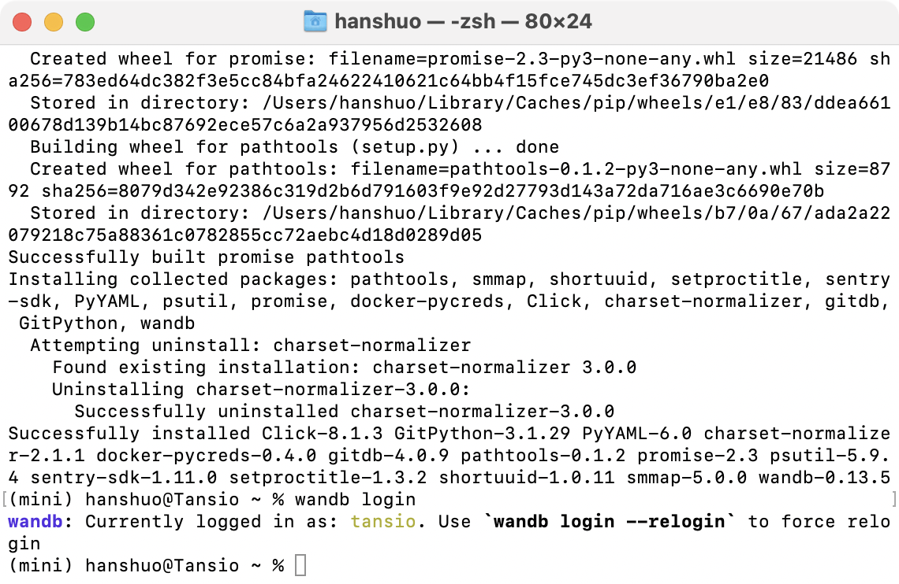
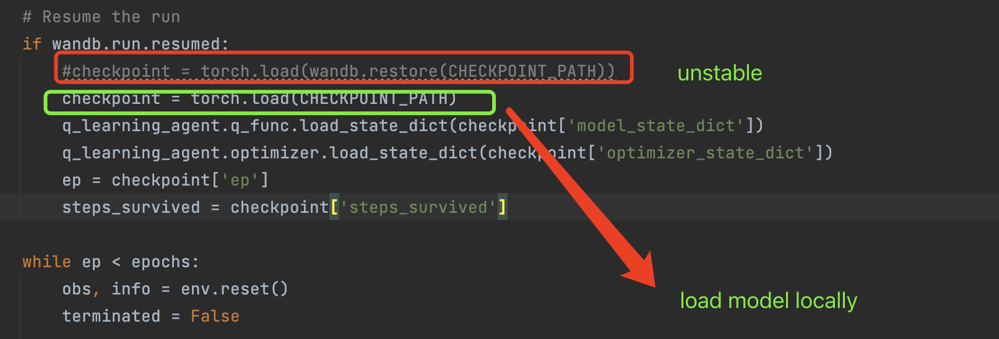
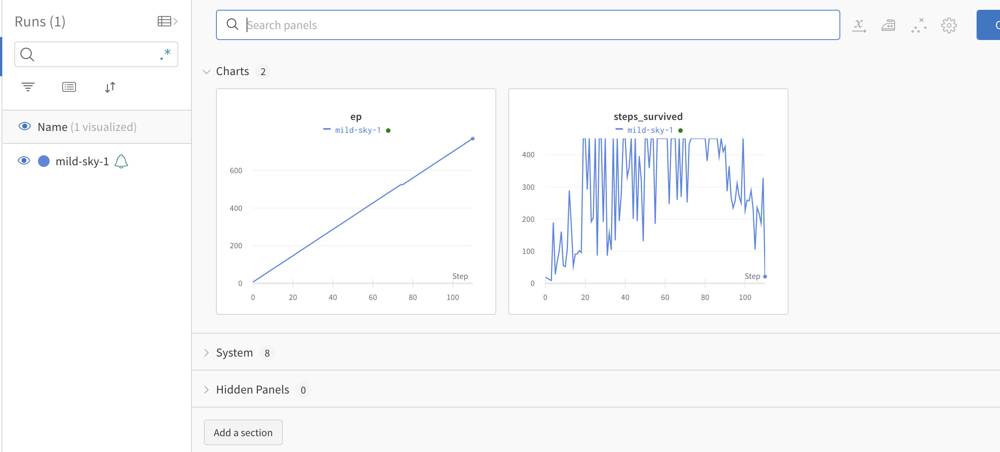
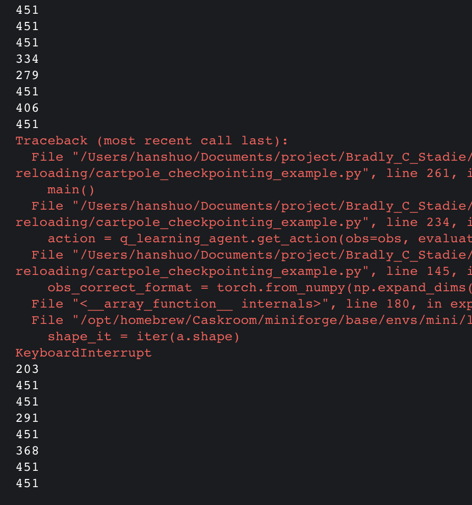
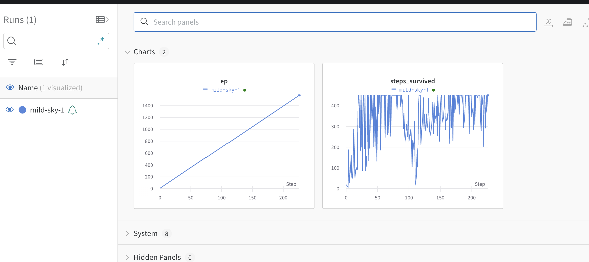

# Using Weights and Biases and Checkpointing and Reloading

Sometimes, we want to be able to check on the status of our experiments without having to log into quest to look at your learning curves. Weights and biases can help with this.

---

 - Register for weights and biases. https://wandb.ai/site
 - On your local machine, add code to the cartpole example so that weights and biases tracks learning progress. You’ll need to add code that logs you into weights and biases.
From the command line, install and log in to wandb:
```
pip install wandb
wandb login
```
- Copy your key from the website and paste it into your command line when asked to authorize your account. 
Verify via the link weights and biases outputs in the terminal works, and you can see the learning curve in real time.



## Checkpointing and reloading

---

The first time you should set `resume = False`. If your process doesn't exit successfully, the next time you run it wandb will start logging from the last step, You can have wandb automatically resume runs by passing `resume=True` to `wandb.init()`
. 
A pytorch training framework
```python
import wandb
import torch
import torch.nn as nn
import torch.optim as optim

PROJECT_NAME = 'pytorch-resume-run'
CHECKPOINT_PATH = './checkpoint.tar'
N_EPOCHS = 100

# Dummy data
X = torch.randn(64, 8, requires_grad=True)
Y = torch.empty(64, 1).random_(2)
model = nn.Sequential(
    nn.Linear(8, 16),
    nn.ReLU(),
    nn.Linear(16, 1),
    nn.Sigmoid()
)
metric = nn.BCELoss()
optimizer = optim.SGD(model.parameters(), lr=0.01)
epoch = 0
run = wandb.init(project=PROJECT_NAME, resume=True)
if wandb.run.resumed:
    checkpoint = torch.load(wandb.restore(CHECKPOINT_PATH))
    model.load_state_dict(checkpoint['model_state_dict'])
    optimizer.load_state_dict(checkpoint['optimizer_state_dict'])
    epoch = checkpoint['epoch']
    loss = checkpoint['loss']

model.train()
while epoch < N_EPOCHS:
    optimizer.zero_grad()
    output = model(X)
    loss = metric(output, Y)
    wandb.log({'loss': loss.item()}, step=epoch)
    loss.backward()
    optimizer.step()

     torch.save({ # Save our checkpoint loc
        'epoch': epoch,
        'model_state_dict': model.state_dict(),
        'optimizer_state_dict': optimizer.state_dict(),
        'loss': loss,
        }, CHECKPOINT_PATH)
     wandb.save(CHECKPOINT_PATH) # saves checkpoint to wandb
     epoch += 1
```

---
**Another example with cartpole**

The quest cluster can be quite unreliable. Jobs can fail randomly. And there are often global time limits. Thus, it is crucial that we have infrastructure for checkpointing and reloading jobs.
`cartpole_checkpointing_example.py` has all the code implemented for checkpointing.

It seems that loading the saved file from wandb is unstable, so it's best to
load your model locally.

- Then the training can be interrupted.


_First time of training then interrupt:_



_continue the process_




- (Not Yet) Write code that checks the jobs time limit (input by the user into the python file). If the time limit is nearing, it will make a checkpoint and kill the job.
