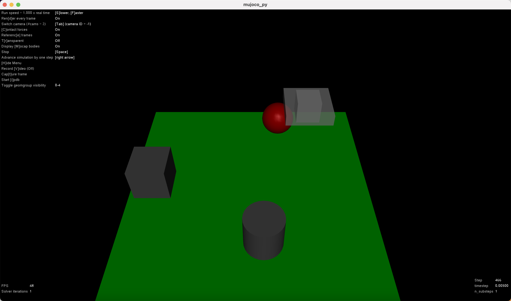
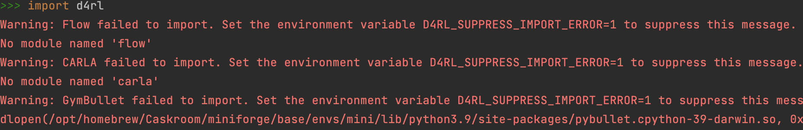
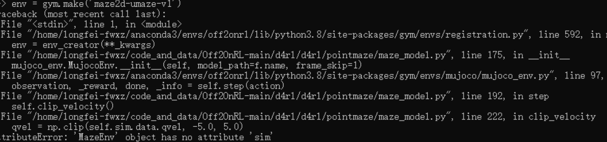

# Installing Mujoco and D4RL locally and on Quest

## UPDATE 02-21-2023

Use Gymnasium Robotics, which has the D4RL environments and which has been confirmed to work without issues: https://github.com/Farama-Foundation/Gymnasium-Robotics

The below instructions are left for legacy reasons, but should never be used. I have personally confirmed that gymnasium robotics works with old policies and code, and that the environments are identical to those in D4RL -- Bradly

## Installing Mujoco

---

`pip install mujoco`

**_This section confirms the user has a working local copy of MuJoCo pip uninstall mujoco_**
```commandline
pip uninstall mujoco
pip uninstall gym
pip install mujoco
pip install gym
```
And in the python console:
```python
import mujoco
import gym
env = gym.make('HalfCheetah-v4')
observation, info = env.reset(seed=42)
action = env.action_space.sample()
observation, reward, terminated, truncated, info = env.step(action)
```
## Installing mujoco_py


---
Install mujoco_py on Mac M1 is complex and you can follow the guide on https://github.com/openai/mujoco-py/issues/682

Mujoco-py currently does not support mujoco2.1.1. The first arm64 release, which is needed for M1 Macs, came out a few weeks ago. Therefore mujoco2.1.1 is needed in order to run MuJoCo natively on the M1 Mac.

**Pre-requisits:**
- make sure you use `Miniforge` as your Conda environment, I first used python 3.10 and it faild
, then I made a new Miniforge environment using python 3.9 and the installing finally worked.
- install glfw via `brew install glfw`. Install glfw when your Miniforge env is activated. 
I first have problem installing glfw, then I uninstall the brew and install brew again https://brew.sh/
  - download MuJoCo2.1.1 image that ends with a `*.dmg`. The new mujoco2.1.1 is released as a Framework. You can copy the `MuJoCo.app` into `/Applications/ `folder.
  - https://github.com/deepmind/mujoco/releases

**Installation Script**
Make a file locally called `install-mujoco.sh`, and put the following into it.
```commandline
mkdir -p $HOME/.mujoco/mujoco210
ln -sf /Applications/MuJoCo.app/Contents/Frameworks/MuJoCo.framework/Versions/Current/Headers/ $HOME/.mujoco/mujoco210/include

mkdir -p $HOME/.mujoco/mujoco210/bin
ln -sf /Applications/MuJoCo.app/Contents/Frameworks/MuJoCo.framework/Versions/Current/libmujoco.2.1.1.dylib $HOME/.mujoco/mujoco210/bin/libmujoco210.dylib
sudo ln -sf /Applications/MuJoCo.app/Contents/Frameworks/MuJoCo.framework/Versions/Current/libmujoco.2.1.1.dylib /usr/local/lib/

# For M1 (arm64) mac users:
# brew install glfw
ln -sf /opt/homebrew/lib/libglfw.3.dylib $HOME/.mujoco/mujoco210/bin

# remove old installation
rm -rf /opt/homebrew/Caskroom/miniforge/base/lib/python3.9/site-packages/mujoco_py

# which python
# exit

export CC=/opt/homebrew/bin/gcc-11         # see https://github.com/openai/mujoco-py/issues/605
pip install mujoco-py && python -c 'import mujoco_py'
```
Then in your terminal cd into this directory and run `sh install-mujoco.sh` to install it.

- After installing you should be able to run
`mujoco_py_test.py`



## Installing d4RL

---
D4RL is an open-source benchmark for offline reinforcement learning. It provides standardized environments and datasets for training and benchmarking algorithms. A supplementary whitepaper and website are also available.
D4RL can be installed by cloning the repository as follows:
```commandline
git clone https://github.com/Farama-Foundation/d4rl.git
cd d4rl
pip install -e .
```
Or, alternatively:
```commandline
pip install git+https://github.com/Farama-Foundation/d4rl@master#egg=d4rl
```
Using d4rl
```python
import gym
import d4rl # Import required to register environments

# Create the environment
env = gym.make('maze2d-umaze-v1')

# d4rl abides by the OpenAI gym interface
env.reset()
env.step(env.action_space.sample())

# Each task is associated with a dataset
# dataset contains observations, actions, rewards, terminals, and infos
dataset = env.get_dataset()
print(dataset['observations']) # An N x dim_observation Numpy array of observations

# Alternatively, use d4rl.qlearning_dataset which
# also adds next_observations.
dataset = d4rl.qlearning_dataset(env)
```


When `import d4rl`, Warnings are fine.



Since we are using the most recent version of gym, when we do  `import d4rl` and `env = gym.make('maze2d-umaze-v1')`
There will be error`AttributeError: 'MazeEnv' object has no attribute 'sim'`. This is because our gym version is too
recent and we need to lower our gym by `pip install gym==0.17.2`

